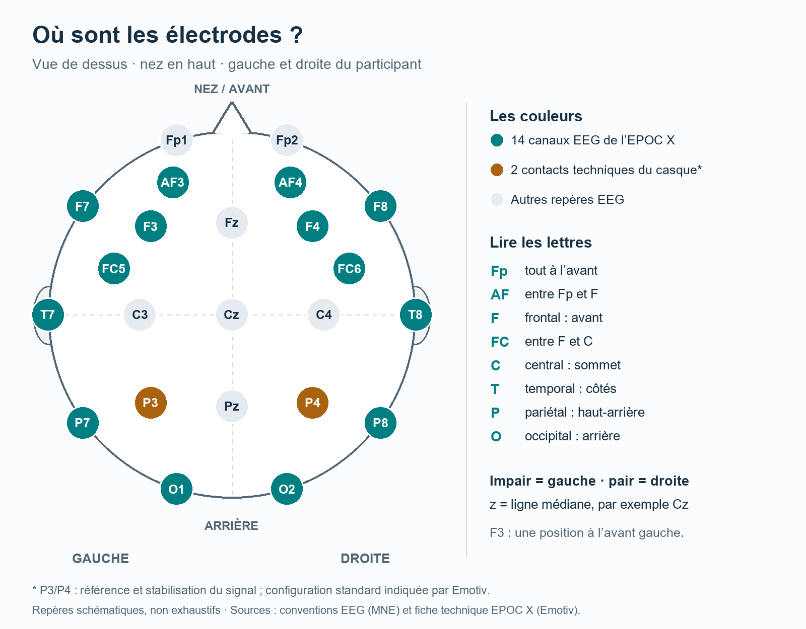
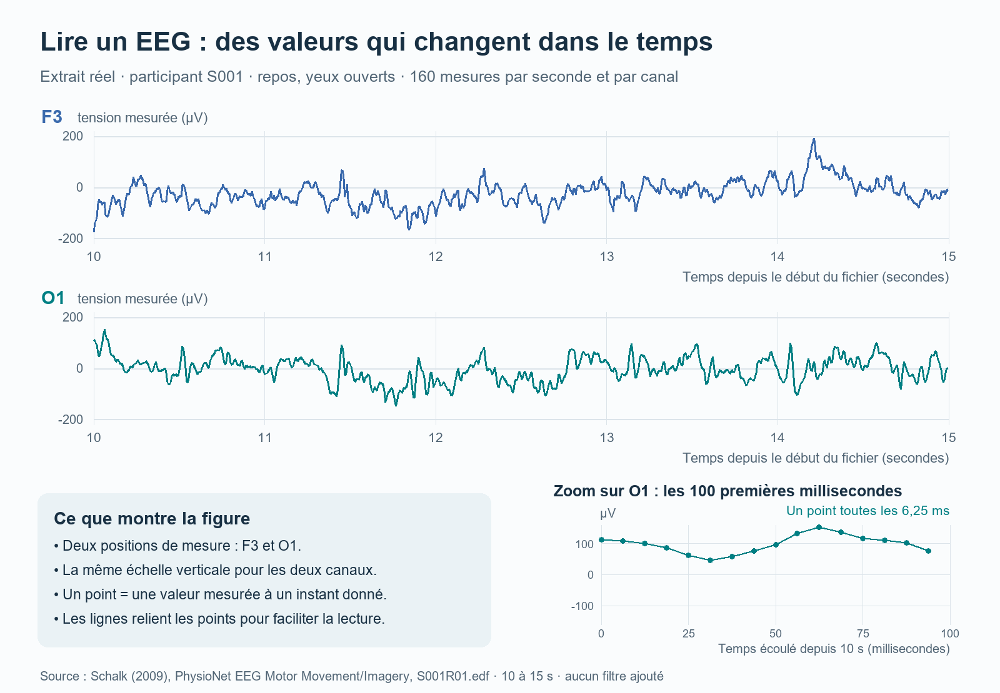

# Neurosciences & AI

X-HEC Entrepreneurs · 2026–2027

Observer des mesures électriques prises sur la tête, comprendre ce qu'elles permettent — et ne permettent pas — d'inférer, puis les utiliser pour commander un objet réel : c'est le fil conducteur de ces travaux pratiques.

L'**électroencéphalographie**, abrégée **EEG**, mesure de petites différences de tension électrique à la surface de la tête. Une **interface cerveau-machine** utilise des caractéristiques de cette activité pour produire une commande. On rencontre aussi le sigle anglais **BCI**, pour *Brain–Computer Interface*.

Le démonstrateur en direct vise un résultat volontairement concret : transmettre quelques commandes discrètes à un **petit bras robotique**, afin par exemple de saisir puis déplacer un objet léger. Le robot ne « lit » pas une pensée libre : une activité ou une réponse cérébrale définie à l'avance est associée à une instruction précise.

## Commencer ici

| Parcours | Ce que l'on y fait |
|---|---|
| [Prise en main autonome](prise-en-main/README.md) — facultative | Observer de vrais enregistrements dans un navigateur, sans casque, sans installation et sans programmation. |
| [TD hors ligne](td/hors-ligne/) | Travail sur des données déjà enregistrées. |
| [TD en direct](td/en-direct/README.md) | Utiliser l'EPOC X pour produire des commandes et piloter un bras robotique ; distinguer une démonstration BCI prête à l'emploi d'un décodage EEG construit et analysé par nous-mêmes. |

## Ce que mesure le casque

Une **électrode** est un contact conducteur placé sur le cuir chevelu. L'appareil mesure une tension entre un site de mesure et une **référence** : l'EEG est toujours une mesure relative. Un **canal** est la suite de valeurs correspondant à une mesure au cours du temps ; à l'écran, cette suite devient une courbe. Le capteur est donc un objet physique, le canal une série de nombres.

Par exemple, deux positions A et B valent respectivement **12 µV** et **5 µV** par rapport à une même référence initiale. Si l'on prend B comme nouvelle référence, A vaut **12 − 5 = 7 µV** et B vaut **5 − 5 = 0 µV**. Ce zéro résulte du calcul : il ne signifie pas que l'activité biologique a disparu. Changer de référence ne supprime pas automatiquement les perturbations. [Approfondissement technique : changer la référence avec MNE](https://mne.tools/stable/auto_tutorials/preprocessing/55_setting_eeg_reference.html).

Le **montage** désigne ici la disposition des électrodes sur la tête. Cette carte montre les principaux repères et les positions utilisées par le casque **Emotiv EPOC X**.

*Schéma de positionnement, non exhaustif. Sources : [repères EEG — MNE](https://mne.tools/stable/auto_tutorials/intro/40_sensor_locations.html) et [configuration du casque — Emotiv](https://www.emotiv.com/epoc-x).*

Chaque canal EEG mesure un mélange de contributions électriques provenant de nombreuses cellules. Il ne mesure pas exclusivement l'activité de la région située sous l'électrode. [Source scientifique : Buzsáki et al., 2012](https://pmc.ncbi.nlm.nih.gov/articles/PMC4907333/).

Les clignements, les contractions musculaires ou un mauvais contact peuvent également modifier fortement les courbes. Un **artefact** est une contribution qui gêne la mesure que l'on souhaite interpréter. Filtrer, détecter un artefact et le corriger sont des opérations différentes. [Exemples et approfondissement technique — MNE](https://mne.tools/stable/auto_tutorials/preprocessing/10_preprocessing_overview.html).

## Lire une courbe et ses unités

L'axe horizontal représente le temps. Les variations verticales représentent la tension mesurée, souvent exprimée en **microvolts**, notés **µV** : un microvolt vaut un millionième de volt. Lorsque plusieurs courbes sont superposées, elles sont souvent décalées verticalement pour rester lisibles ; la courbe située le plus haut n'est donc pas nécessairement la plus forte.

L'ordinateur conserve des mesures à intervalles réguliers. Chaque valeur est un **échantillon**. La **fréquence d'échantillonnage** indique combien de valeurs sont enregistrées par seconde, pour chaque canal.

Le **hertz**, noté **Hz**, signifie « par seconde ». Il intervient dans deux questions différentes :

| Indication | Signification concrète |
|---|---|
| Enregistrement à **160 Hz** | 160 mesures par seconde et par canal ; deux mesures successives sont espacées de 1/160 seconde, soit 6,25 ms. |
| Oscillation du signal à **10 Hz** | Une variation qui se répète environ 10 fois par seconde. |

Ainsi, « **64 canaux, 160 Hz** » signifie 64 séries mesurées chacune 160 fois par seconde. Cela ne signifie pas que le cerveau oscille à 160 Hz.

À fréquence d'échantillonnage constante `fₛ`, une durée `T` contient `N = T × fₛ` valeurs par canal. À 160 Hz, une fenêtre de 2 secondes contient 320 valeurs par canal. Une **fenêtre** est le morceau de signal sur lequel on effectue un calcul.

### Un véritable extrait, puis les nombres qui le composent

Les deux grandes courbes montrent cinq secondes du même enregistrement. Le zoom ne montre que les 100 premières millisecondes de cet extrait. Chaque point correspond à une valeur du fichier ; les lignes entre les points facilitent la lecture.

Voici les quatre premières valeurs de l'extrait :

| Temps depuis le début du fichier (s) | F3 (µV) | O1 (µV) |
|---:|---:|---:|
| 10,00000 | −174 | 112 |
| 10,00625 | −141 | 109 |
| 10,01250 | −131 | 100 |
| 10,01875 | −110 | 86 |

Une valeur négative signifie que le potentiel mesuré est inférieur à la référence choisie. Son signe ne signifie pas que l'activité cérébrale est « bonne » ou « mauvaise ». La forme des courbes ne suffit pas non plus à identifier une pensée ou l'origine d'un pic.

**Source du tracé et du tableau :** Schalk (2009), *EEG Motor Movement/Imagery Dataset*, version 1.0.0, PhysioNet, [fichier S001R01.edf](https://physionet.org/files/eegmmidb/1.0.0/S001/S001R01.edf), canaux F3 et O1, intervalle de 10 à 15 secondes. Les valeurs sont converties en microvolts selon l'étalonnage du fichier, sans ajout de filtre ni changement de référence. Données sous [licence ODC-By 1.0](https://physionet.org/content/eegmmidb/view-license/1.0.0/).

## Pour poursuivre

- La [prise en main autonome](prise-en-main/README.md) permet d’observer directement des enregistrements EEG réels sans installation.
- Le [TD hors ligne](td/hors-ligne/) est réservé au travail sur des données déjà enregistrées.
- Le [TD en direct](td/en-direct/README.md) contient toute la progression expérimentale avec l’EPOC X et le bras robotique : validation du robot, première boucle BCI, décodage EEG explicite, commande endogène et test sur un nouveau participant.
